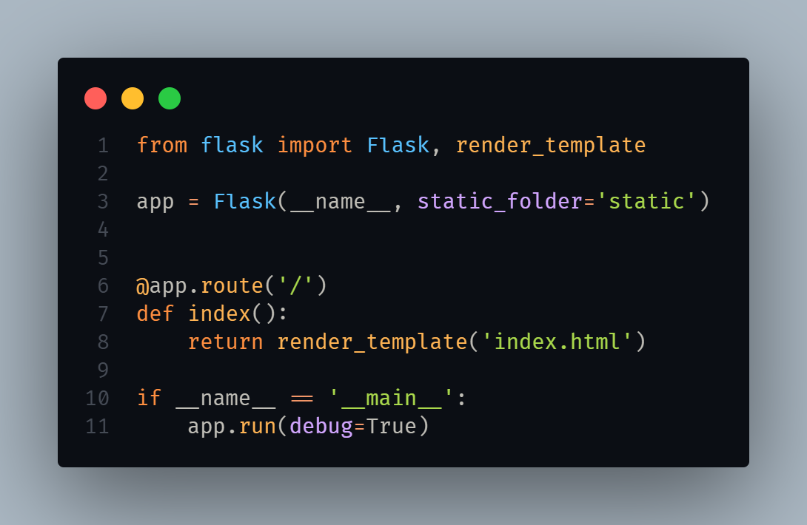
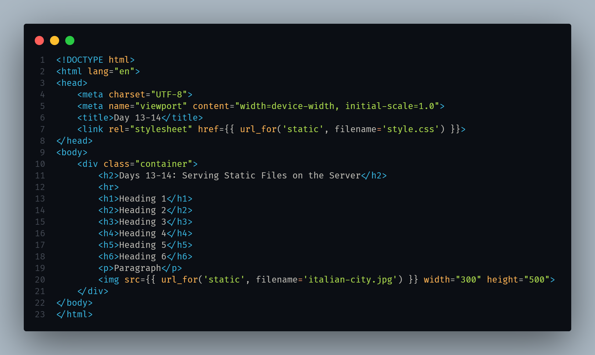
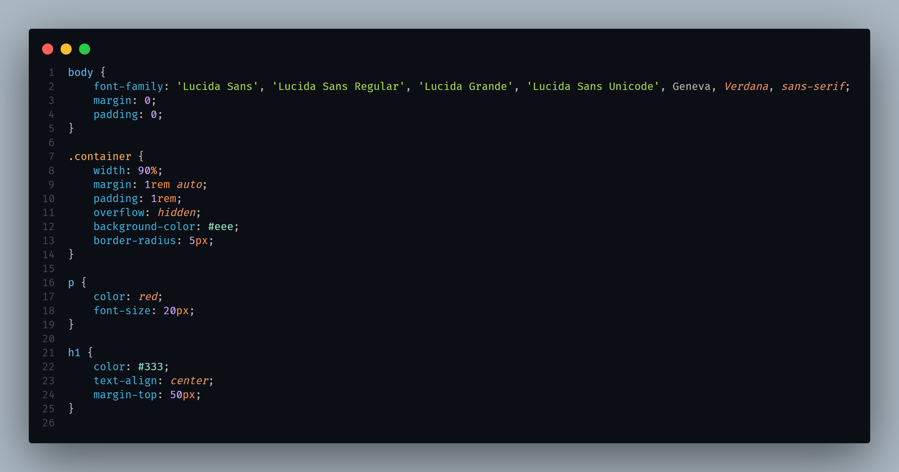
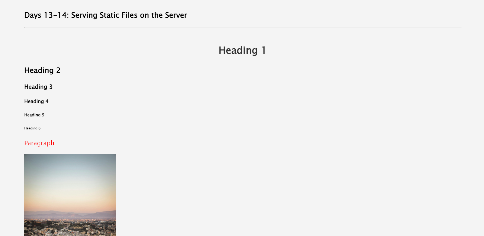

# Serving Static Files on the Server

This project focuses on serving static files such as images, CSS, JavaScript, and fonts on the backend using Flask.

## Table of Contents

- [Introduction](#introduction)
- [Setup](#setup)
- [Usage](#usage)
- [Serving Static Files with Flask](#serving-static-files-with-flask)

## Introduction h

In this project, we have implemented a method to serve static files on the backend server using Flask. This allows us to efficiently manage and deliver static content to the client-side of our web application.

## Setup

To set up this project, follow these steps:

1. **Clone the repository:**

2. **Install dependencies:**

3. **Run the server:**

## Usage

Once the server is running, you can access the static files by navigating to the appropriate URLs. Here are some examples:

- **Images:** `http://localhost:3000/static/images/image.jpg`
- **CSS:** `http://localhost:3000/static/css/styles.css`
- **JavaScript:** `http://localhost:3000/static/js/script.js`

Make sure to replace `http://localhost:3000` with your server's address if you're hosting it elsewhere.

## Serving Static Files with Flask
A generalized illustration of serving static files using Flask for this task:

#### Index html template:

#### CSS Static file:

#### Browser View:

